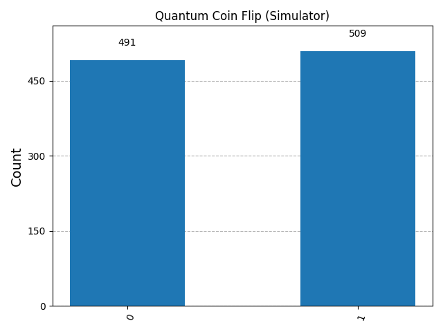

# 🪙 Quantum Coin Flip Simulation

A beginner-friendly quantum computing project that simulates a **coin flip** using a **quantum circuit** with Qiskit.
This project introduces **superposition, measurement, and quantum randomness** in a fun, intuitive way.

---

## 🚀 Features
- Quantum circuit design using **Hadamard gate**
- Run on **Simulator** (ideal for fast and accurate results)
- Run on **Real IBM Quantum Hardware** (see real-world noise effects)
- Compare with a **classical random coin flip**
- Visualize outcomes with histograms

---

## 📊 Demo Results

### Simulator (Ideal Quantum Randomness)


### Real IBM Quantum Device (With Noise)


---

## 🛠️ Tech Stack
- **Python 3.8+**
- **Qiskit** (Quantum SDK)
- **Matplotlib** (Visualization)
- **IBM Quantum Experience** (for real hardware)

---

## ⚙️ Setup & Installation
1. Clone the repo:
   ```bash
   git clone https://github.com/Guna-Asher/quantum-coin-flip.git
   cd quantum-coin-flip
   ```
2. (Optional but recommended) Create and activate a virtual environment:
   ```bash
   python -m venv venv
   # Windows
   venv\Scripts\activate
   # macOS/Linux
   source venv/bin/activate
   ```
3. Install dependencies:
   ```bash
   pip install -r requirements.txt
   ```
4. (Optional) To run on real IBM Quantum hardware, set up your IBM Quantum account:
   - Create an account at [IBM Quantum Experience](https://quantum-computing.ibm.com/)
   - Get your API token from your account dashboard
   - Save the token securely; you will be prompted to enter it when running the script with real hardware option

---

## 🚀 Running the Project

Run the quantum coin flip simulation script:

```bash
python coin_flip_simulator.py
```

By default, this runs the quantum circuit on the simulator and shows the results.

To run on real IBM Quantum hardware, use the command line argument `--real`:

```bash
python coin_flip_simulator.py --real
```

You will be prompted to enter your IBM Quantum API token if not already configured.

---

## 🧪 What the Script Does

- Creates a quantum circuit with a Hadamard gate to simulate a coin flip
- Runs the circuit on a simulator or real IBM Quantum device
- Performs a classical random coin flip for comparison
- Visualizes results with histograms saved in the `results/` directory
- Saves histograms as `simulator_histogram.png` and `real_device_histogram.png`

---

## Notes

- Ensure the `results/` directory exists or the script will create it automatically
- Running on real hardware may take longer due to queue times and network latency
- Requires internet connection for real hardware runs
